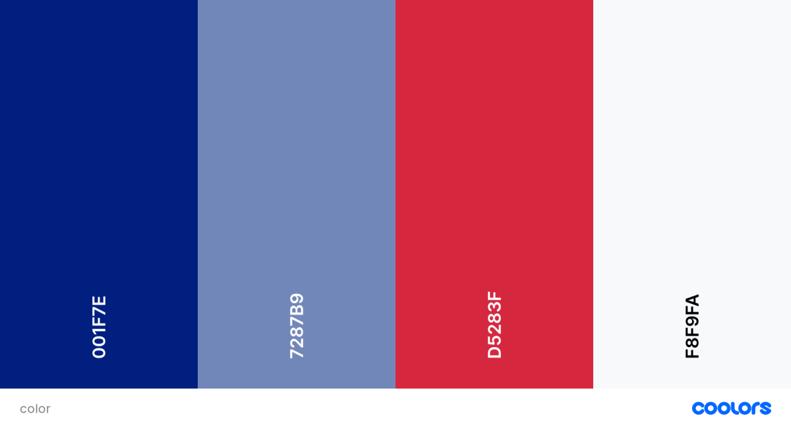

# London Walking Tour

### Summary

> - The objective is to assess my webdevelopment skills. 
> - The languages used will be HTML, CSS and Java Scrip. 
> - The layout of the website consist of 4 pages, initial home page containing 4 sections and 3 pages containing each individual tour, map and contact form. This project is scalable and more tours can be added in the future.
---

### Table of Contents

> - [Overview](#overview)
> - [User Stories](#user-stories)
> - [UX](#ux)
> - [Features](#features)
> - [Technologies Used](#technologies-used)
> - [References for learning](#references-for-learning)
> - [Testing](#testing)
> - [Project barriers and solutions](#project-barriers-and-solutions)
> - [Code validity](#code-validity)
> - [Version Control](#version-control)
> - [Deployment](#deployment)
> - [Credits](#credits)
> - [Acknowledgments](#acknowledgments)
> - [Support](#support)

### Project Goal 

> The aim of this project is to showcase London's Hiden Gems destinations and promote walking tours around town for both, turists or citizena.
---

#### User Stories

> - _"I find myself doing the same thing in London week in week out"_
> - _"I want to find unusual ways to enjoy the capital"_
> - _"I want to know more of London architecture history"_
> - _"I want to be able to locate myself on the map"_
> - _"I want to be able to contact the provider for further queries"_
> - _"I want to browse their social media"_
---

### UX

> This website project target individuals or groups, turists or London citizen that seek to discover new places in the capital. The objective is to show in a simple and visual manner why they should take a walking tour. Contact page and social media link are important user journey features for decision making.
---

#### 1. Strategy

> The UX is clean and user-friendly providing an easy navigation between pages.
>
> ##### Project Goals:
>
> - Showcase our tours on homepage. 
> - Promoting our business through about us section. game reserves by showcasing the best they have to offer.
> - Provide further information on the Tour page such us, directions on Google map, link to a call now and download tour pdf.
> - Contact page for book a tour.
> - Social links for customer engagement.

> ##### Customer Goals:
>
> - Designed for desktop and Mobile approach.
> - Display interactive maps for each meet-up point.
> - Contact form for direct email.
> - Social Media icons in the footer.
> - Fixed navigation bar allowing the user to easily move between pages.
> - Download iteneraty pdf.
---

#### 2. Scope

> - Provides a clean UX for users with easy navigation.
> - Applied my current skill-set of HTML, CSS, JavaScript and API use.
---

#### 3. Structure

> The main focus of the structure is to allow Users to quickly find their way around the website. page, whethter it is to contact or find more about tours location.
> Short snipet of content on home to awaken their curiosity and not overwhelm.
> The Tour page contain a pdf document with the tour highlighta and images. 
> Meetup points are shown on map.
> Contact form is avaliable from contact page via email.
---

#### 4. Skeleton

#### 5. Surface

> ###### Colours
>
> Union Jack flag colours were chosen to fit with the image that London brings to memory due to its red bus and red phone box.
> 
>
> ###### Typography
>
> - "Lora" font was choosed as primary due to its balanced and comtempory look. Sans-serif font will fall-back in case any error accuer.
>
> ###### Images
>
> The images selected for the website is to showcase London's big attraction.  
> The pdf documents images showcase each individual tour.
>
> ###### Maps
>
> Interactive map can be accessed in two ways, from the map itself or from show on map buttom for zoomed in location. 
>
> ###### Design Choices
> * On the intro page, I have specifically decreased the image transition rate in the image carousel, to subtly show the zebra pattern beneath momentarily between each slide. I felt that vivid and immediate image transitions would break the consistency of the ux and theme.
> * Original layout from wireframe 'felt' different on screen to how I had first imagined it; and as a result, I decided on an alternative layout midway through the project. [Original Wireframe](https://github.com/JimLynx/CI-MS2-Safari-Africa/blob/master/assets/docs/Wireframes.pdf)
---

### Technologies Used

##### 1. Languages Used

>  [HTML5](https://en.wikipedia.org/wiki/HTML5)
>
>  [CSS3](https://en.wikipedia.org/wiki/Cascading_Style_Sheets)
>
>  [JavaScript](https://en.wikipedia.org/wiki/JavaScript)
